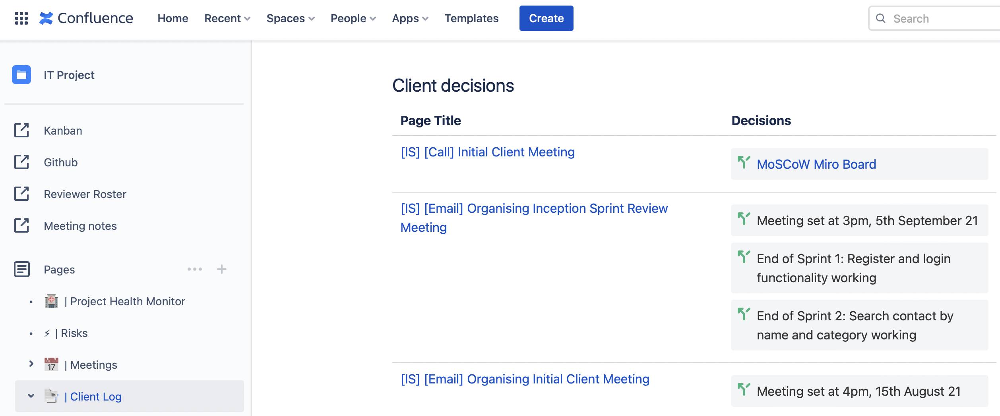

# Workshop 2

## Before the Tutorial Begins...

By now all teams should have decided on and set up:

1. Weekly teem meetings;
2. Communications channel;
3. Code repository; and
4. Document repository.

*Please see [Workshop 1](workshop_1.md) for more information*.

## Today's Workshop

### Purpose

The purpose of workshop 2 is to familiarise teams with how to work well with a client.

In SWEN90009, your team will be delivering project requirements to a client.  
Most students would have experience with university assignments - the aim of today is to familiarise students
with how to interact work well with a real-life client. For many teams, this will be the first time they work
with a client (and working using the Agile methodology).

### Client Communications

Your client will be assigned by the Subject Coordinator, and once your client is assigned, you should contact them.

Throughout the semester, you should work closely with your client.  
You will need them to:

1. Aid your team in developing requirements for your system;
2. Review progress after each sprint; and
3. Provide feedback for prototypes;

It is imperative that you communicate all important product decisions with your client and involve them by seeking their feedback.

Communication with the client takes place through the Product Owner - they are the conduit of information between the
team and the client, and as such, will be responsible for emailing the client with updates, invitations for meetings,
etc.

To learn more, please see the [Agile Methodology Guide](../guides/agile_methodology.md).

#### Making initial contact with your client

You should contact your client via their provided email address.
Your initial contact should introduce your team members and decide on a convenient time to meet.

To decide a common time to meet, you can use a scheduling tool, like [When2Meet](https://www.when2meet.com), to elicit their availability.

#### Creating Meeting Invites

Once an available time has been decided with your client, send them a calendar invite for the meeting. This way, both 
your team and the client will not forget. Instructions on how to do this can be found [here](https://support.google.com/calendar/answer/72143?hl=en&co=GENIE.Platform%3DDesktop#zippy=).

If the meeting will take place virtually, you can make use of the free Zoom account provided by the university to schedule Zoom meetings.
Please follow the instructions to set up Zoom scheduling with your university Gmail account [here](https://workspace.google.com/marketplace/app/zoom_for_gmail/585972765488).

#### Logging Client Communications

All important decisions and milestones reached with the client via email should be logged in the team's Confluence:

This is to foster a shared understanding of agreements reached with the client. Your supervisor generally will not
attend client meetings, so this also allows them to stay informed.

#### Sharing a Team Calendar

In large teams, it can be difficult to keep up with the number of meetings that take place. There are tools that take 
out the hassle of coordinating meeting invitations and reminders.

One that works well is [Google Calendar for Slack](https://slack.com/intl/en-au/help/articles/206329808-Google-Calendar-for-Slack).
It can remind team members of meetings from directly in Slack, if this is your chosen communications channel.
If you have chosen a different application, you are welcome to search for plug-ins that work between it and Google 
Calendar.

### Client Meetings

Once a meeting is set with the client, the team should set up the Confluence page for the meeting - you can make use of
[Confluence's built-in meeting template](https://www.atlassian.com/software/confluence/templates/meeting-notes).

On the meeting page, you should display:

- Attendees (and apologies);
- Agenda - all team members should be encouraged to contribute questions in advance;
- Minutes of the meeting (discussion items); and
- Recording of the meeting, if the meeting takes place virtually (i.e. on Zoom). You can read [here](https://support.zoom.us/hc/en-us/articles/201362473-Starting-a-local-recording)
  how to record meetings on Zoom.

Before the meeting, the team can allocate roles and responsibilities for team members. It is a good idea to rotate 
these roles throughout the semester.

| Roles               | Responsibilities                                                                                                                                                                                                                                                                                                                                                          |
|---------------------|---------------------------------------------------------------------------------------------------------------------------------------------------------------------------------------------------------------------------------------------------------------------------------------------------------------------------------------------------------------------------|
| Meeting Coordinator | It is generally a good idea to set one person as the meeting coordinator. This person **is not responsible** for speaking the entire time, but they are responsible for making sure the meeting has structure and direction, and that all questions in the agenda are asked and answered. **All team members** are encouraged to talk and ask questions during a meeting. |
| Minute Taker        | This person is responsible for ensuring all discussions are well-documented (in Confluence). They are also responsible for emailing the minutes taken during a meeting to the client (within a day or two of the meeting).                                                                                                                                                |

An example client meeting page can be found [here](assets/2_workshop_2.pdf).

## Extra Resources

As always, you can find additional information in [Guides](../../for_canvas/guides).
