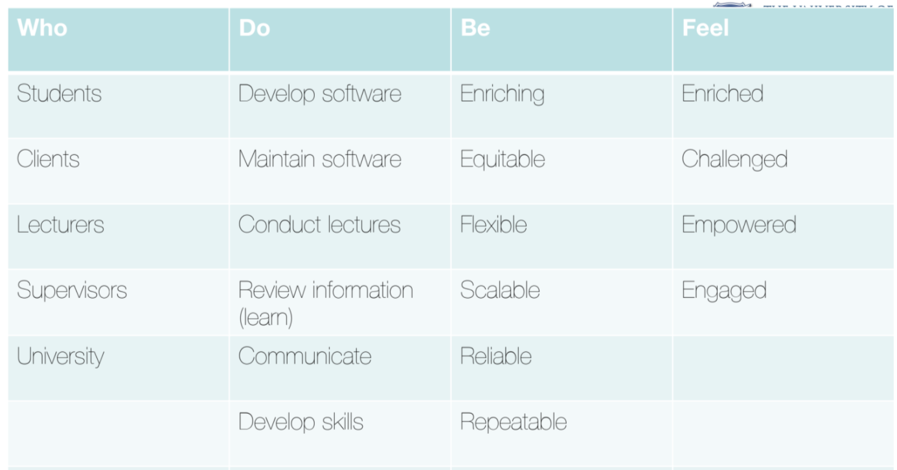
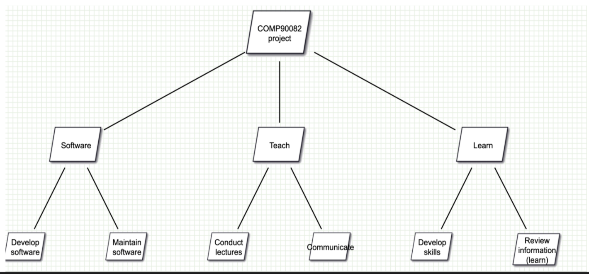
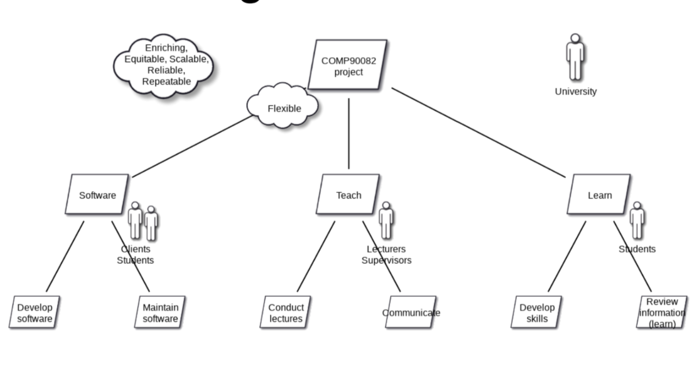
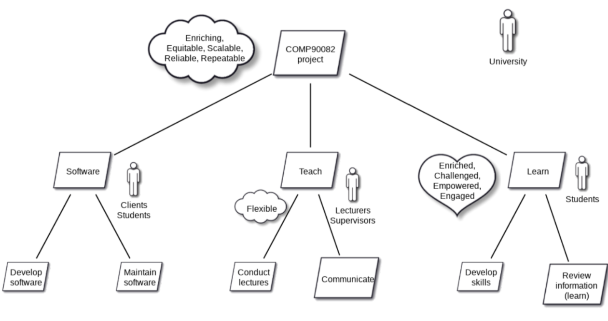
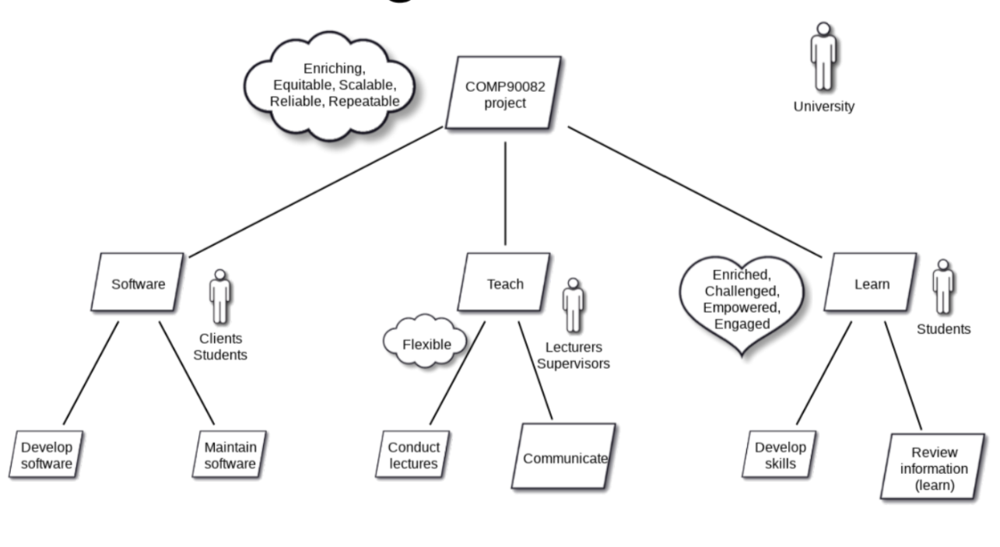

# Workshop 3

## Before the Tutorial Begins

By now all teams should have:
1. Emailed the client to schedule your initial client meeting  

*Please see [Workshop 2](workshop_2.md) for more information*.

## Today's Workshop

### Purpose

The purpose of workshop 3 is to learn about requirements elicitation and a [framework](#motivational-modelling) to model 
key project requirements.

### Requirements Elicitation

Requirements elicitation refers to a broad spectrum of tasks that lead to an understanding of requirements. Currently, 
you have been provided with a project brief/overview. Over the coming weeks, you need to have conversations with your 
client, to understand:
- What is the problem that your client wants to solve?
- Who are the key stakeholders and target audience for the system?
- What are the user goals of the system? What objectives does a user want to achieve within the context of the application?
- What is the nature of the application and how will it be used by the intended audience in their day-to-day life?

#### Understanding business goals: Initial client meeting

The initial client meeting plays an important role in requirements elicitation. In this meeting, you aim to establish 
an understanding of what the current problem and business need is.

To prepare for this meeting, brainstorm questions to ask your client and add it to your meeting agenda. These questions 
should help you establish:

- Business needs
- Target audience
- User goals/features [(functional and non-functional requirements)](#terminology)
- Nature of solution: mobile/web/etc
- How system is to be used

Once you have finalised your questions, send the client a copy of the meeting agenda. If the client has not thought 
about some of these questions before the meeting, they may struggle to give you an answer on the day. By providing them 
a copy of the agenda beforehand, your client is well positioned to give meaningful answers.

#### Beyond Functional/Non-Functional

When building a system, it is important to consider how users to feel when interacting with the application. If users 
have an unpleasant experience, they typically won't use it again, even if it meets all the functional/non-functional 
requirements.

Thus, emotional experiences of users are important and teams should endeavour to capture these in their project 
requirements. One way of doing this, is by using a technique called motivational modelling.

##### Motivational Modelling

Motivational modelling helps model [functional, non-functional, and emotional goals](#terminology), allowing teams to 
reach a shared understanding of the project with the client.

Motivational modelling is done through brainstorming a list of the key requirements of the system and stakeholders 
involved. The list is called a DO/BE/FEEL/WHO list, and should detail:

- **DO**: what your system can do? (functional goals)
- **BE**: how your system should behave? (non-functional goals)
- **FEEL**: how users should feel when using the system? (emotional goals)
- **WHO**: key stakeholders

This is then used to create a visual representation of the system requirements as you can see below.

##### Process

There are many tools that you can use for motivational modelling. The subject will give you access to the
[motivational modelling editor](https://www.motivationalmodelling.com/), but other diagram tools can also be used 
(Miro, Lucidchart, etc.).

1. Create a DO/BE/FEEL/WHO list for your project.

2. Use the DO list to create the basic tree structure for your model. This is done by establishing the do hierarchy, by 
clustering together similar requirements and goals.

3. Add the WHO elements to corresponding sections of the model. 
4. Add the BE elements to the corresponding sections of the model. 
5. Add the FEEL elements to the corresponding sections of the model.
6. Consult your diagram with the client and check whether this matches their understanding of the project.

**Note**: The entire motivational modelling process can be done with the client, but typically teams involve the client 
after a basic model as clients often time constraints.

##### User Requirements from motivational modelling

Later in the subject, you will learn about [user stories](../guides/agile_methodology.md) as a way of representing your 
requirements. Typically, the bottom leaves of your motivational model correspond to your user stories.

## Terminology

| Requirement type | Definition                                                         |
|------------------|--------------------------------------------------------------------|
| Functional       | What the system should do?                                         |
| Non-functional   | How the system should be? E.g. secure, private, accessible for all |
| Emotional        | How users should feel when using the system                        |

## Extra Resources

- [Motivational Modelling](https://www.swinburne.edu.au/research/centres-groups-clinics/centre-for-design-innovation/our-research/future-self-living-lab/motivational-goal-modelling/)
- [Motivational Modelling Editor](https://www.motivationalmodelling.com/)
- [Papers on motivational modelling](https://www.motivationalmodelling.com/papers/)

As always, you can find additional information in [Guides](../guides).
